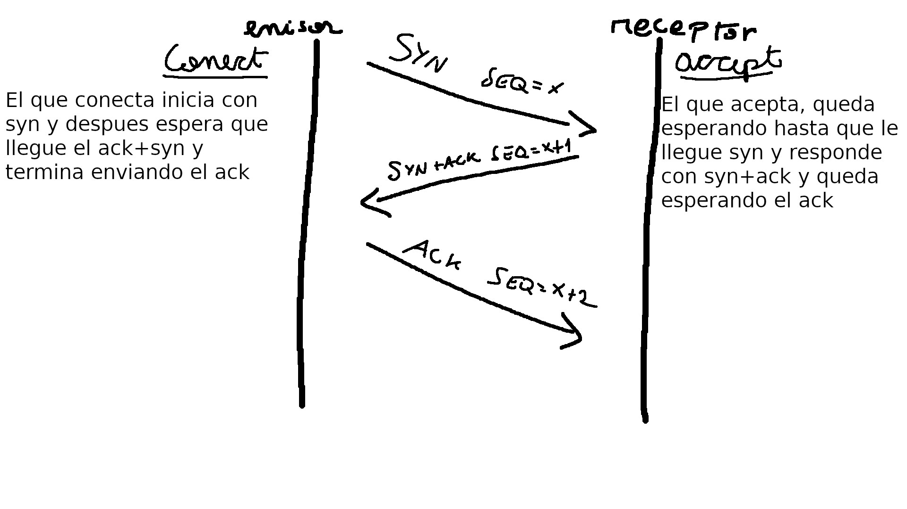
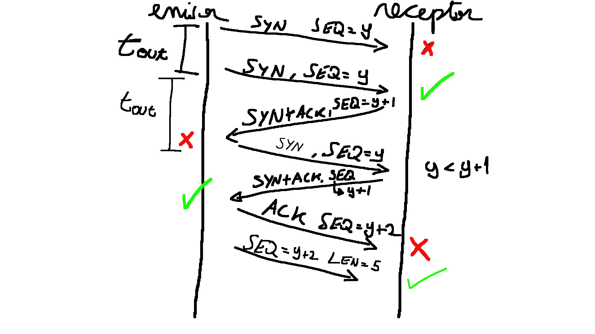

# TCP (Stop and wait)
> Autor: Joaquin Lopez
## Estado
En el estado actual, el codigo corre todos los tests provistos en los codigos
[test_clientTCP.py](src/test_clientTCP.py) y [test_serverTCP.py](src/test_serverTCP.py),
con y sin inducir perdidas via netem.

Para las pruebas, se decidio hacer un ejemplo simple de una sola llamada de server y cliente
en los archivos [server.py](src/client.py) y [client.py](src/server.py)

Para ejecutar las pruebas, se debe de ejecutar primero el server 
```bash
python3 server.py <ip> <port> 
```
y luego el cliente que recibe un archivo de texto
```bash
python3 client.py <ip> <port> < <algunarchivo.txt>
```

Se probo con varios buffsizes incluyendo impares.

## Diagramas y desiciones de diseño
Para la seccion 4 se adjunta la imagen junto a la explicacion.


Tambien el diagrama para la seccion 7


Para el diagrama 7 se tomo la desicion de:

__Si se pierde el ultimo ACK, podemos arreglarlo si permitimos que el mensaje de datos que nos llegue en el futuro, sea el mensaje que permita hacer ACK de que si estamos comunicados.__

Esto lo podemos ver al final del diagrama de la seccion 7, al receptor le llega un mensaje con datos y como toma ese como un ACK, sale de la funcion de `accept` y entra a la funcion para `recibir`